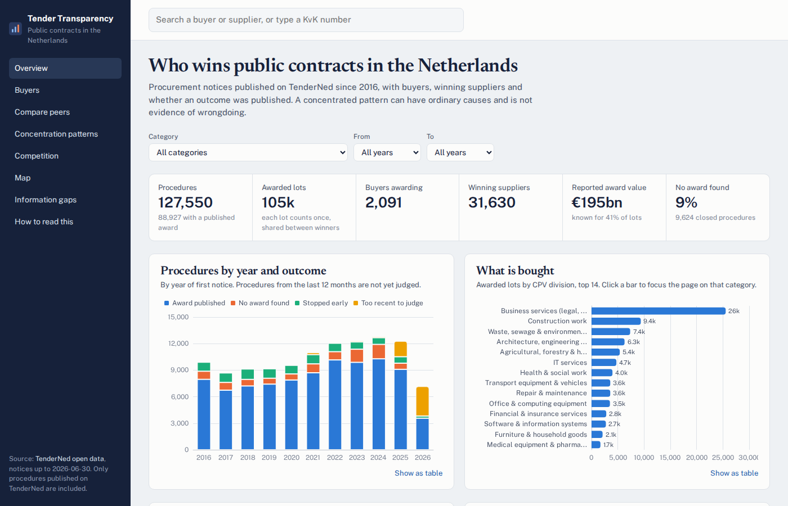

# Tender Transparency NL

Interactive dashboard for exploring who wins Dutch public contracts, how concentrated
purchasing is compared with similar buyers, and where the published record is incomplete.
Source: [TenderNed open data](https://www.tenderned.nl/cms/nl/aanbesteden-in-cijfers/datasets-aanbestedingen)
(OCDS JSON, 2016 onwards), enriched with PDOK (municipality, province) and CBS (population).



## Quick start

Requirements: [uv](https://docs.astral.sh/uv/) (Python 3.12+), [pnpm](https://pnpm.io/installation) (Node 20+),
about 1.5 GB of disk and several GB of RAM (ingest holds all rows in memory before writing).

```bash
./setup.sh                                  # dependencies, download (~850 MB), clean, model, frontend
uv run uvicorn api.main:app --port 8000     # API + built frontend on http://localhost:8000
```

`setup.sh` can be re-run at any time. Valid downloads and enrichment lookups are reused, so a
rebuild takes about 3 minutes; the first run also waits for the download and ~19,000 PDOK lookups.

| Option          | Effect                                   |
|-----------------|------------------------------------------|
| `--no-download` | build from the files already in `data/raw/` |
| `--no-web`      | skip the frontend build                  |

Stop the API before running it: DuckDB allows only one writer, and the script refuses to
start while `uvicorn api.main` is running.

For frontend development, run `pnpm dev` in `web/` (proxies `/api` to port 8000).

## What the setup does

1. **Download** (`etl/download.py`). Reads the file links from the TenderNed dataset page (the upload
   folder in the URL changes with every release, e.g. `2025-12/`, `2026-07/`), downloads each yearly
   JSON with resume and retries, and only accepts a file once it is complete and parses as OCDS
   with a `releases` list. Truncated downloads are resumed, not silently loaded. Files for periods
   TenderNed no longer lists (a half-year file replaced by the full year) are moved to
   `data/raw/superseded/` so they are not loaded twice.
2. **Ingest** (`etl/ingest.py`). One release is one notice: notices, buyers, suppliers, lots, bid
   statistics and awards go into raw DuckDB tables in `data/tenders.duckdb` (recreated each run).
   KvK numbers are normalised to 8 digits, supplier names get a comparison key without legal
   forms (B.V., N.V., holding, groep, ...), postcodes are upper-cased without spaces.
3. **Enrich** (`etl/enrich.py`). Postcodes and place names are geocoded with PDOK Locatieserver,
   municipal population is fetched from CBS StatLine 03759ned, and generalised municipal
   boundaries for the map come from CBS/PDOK. Everything is cached in `data/cache/`: a first run
   makes ~19,000 lookups, later runs only fetch new values. Failed lookups are retried on the next run.
4. **Model** (`etl/model.sql`, run by `etl/model.py`). All cleaning and analysis:
   - **Procedure linking.** Award notices imported from Mercell often carry a new procedure ID. They
     are re-attached to the open contract notice with the same buyer and the same title or buyer
     reference within three years, or via explicit cross-references.
   - **Supplier identity.** Keyed by KvK number. A name without a KvK number is matched to one when
     that exact normalised name appears with exactly one KvK number elsewhere. Placeholder
     suppliers ("zie bijlage", "n.v.t.", "meerdere", "onbekend", ...) are dropped.
   - **Buyer roll-up.** Municipal departments and name variants ("College van B&W van ...",
     "Gemeente X, afdeling ICT", "Gemeente Langedijk nu gemeente Dijk en Waard") are rolled up to the
     municipality's CBS code. Shared accounts that name several municipalities go to the one named
     on most notices.
   - **Lot weighting.** Each lot counts once and is split between its winners, so open-house
     admission procedures with hundreds of suppliers don't dominate.
   - **Values.** Placeholder amounts (< €100), non-EUR and > €5bn amounts are treated as unknown.
     When all suppliers on a lot report the same amount it is split between them. Amounts far outside
     what the buyer type, the estimate or the bids support (≥ €250m for non-central buyers,
     > 20× the estimate or the highest bid) are kept as reported but excluded from totals.
   - **Bid counts.** Before eForms (late 2023) tender counts are per procedure, so multi-lot procedures
     only count when a single tender came in. Platforms that report "1 tender" by default are
     excluded per year.
   - **Reproducibility.** Ties (same-day notices, equal shares, equally common names) are broken
     explicitly and fractional sums are rounded, so every rebuild from the same files gives the
     same tables and the same flags.
5. **Frontend** (`web/`). `pnpm install --frozen-lockfile && pnpm build` into `web/dist/`, served by the API.

## Refreshing the data

TenderNed publishes a new dataset every six months. Stop the API and run `./setup.sh --no-web`.
When the data reaches a new year, also update:

- `etl/model.sql`: the `periods` table (currently ends with `2025-2026`)
- `etl/enrich.py`: the CBS population year range (`range(2015, 2027)`) and `BOUNDARY_YEAR`; delete
  `data/cache/population.json` so it is fetched again

## Layout

- `setup.sh`: end-to-end build
- `etl/download.py`: TenderNed dataset download and validation
- `etl/ingest.py`: OCDS releases to raw DuckDB tables
- `etl/enrich.py`: postcode/municipality/province lookups, population and map boundaries
- `etl/model.sql`: all analysis logic: procedure linking, supplier identity, buyer roll-up, value cleaning, concentration, competition, peer groups, flags
- `api/main.py`: read-only FastAPI JSON API over `data/tenders.duckdb`
- `web/`: React + Vite + ECharts dashboard
- `data/` (not in git): `raw/` downloads, `cache/` enrichment lookups, `tenders.duckdb`

## Method in brief

The in-app page "How to read this" is the full reference. Key choices:

- Linking orphaned award notices cut the apparent "no award found" rate from about 22% to about 12% in 2023–2024.
- Before 2024 many notices only give a supplier name; KvK coverage is about 75% before 2024 and 95% after.
- Peers are buyers of the same type and size band, in the same CPV division and three-year period.
  Municipalities are sized by population, other buyers by the number of procedures they publish.
- Competition: tenders received per lot, the share of competitive lots with a single tender, and the share
  of lots given as direct awards (negotiated without a prior call for competition). "Few bidders" flags
  buyers where at least half the lots drew one tender, 25 points above the peer median.
- A flag ("unusual") needs at least 5 lots from at least 3 procedures, at least 5 peers, and adequate data.
  The top supplier must hold at least 50%, the buyer must be in the top 10% of peers by HHI, and the share
  must be at least 20 points above the peer median. A flag is a prompt to look closer, not a finding.

## Scope

Netherlands only, TenderNed only. The model keeps country-specific parts (buyer typing,
CBS population, PDOK) separate so other countries (for example TED data) can be added later.

## Disclaimer

This is an independent project, not affiliated with TenderNed, PIANOo or any other government body.
The figures describe patterns in published notices and how complete those notices are. They are not
findings of misconduct, irregularity or breaches of procurement law by any buyer or supplier. The source
data contains errors and the processing adds simplifications of its own; check the original notice on
TenderNed before relying on a figure.

## License

[MIT](LICENSE). The code is provided as is, without warranty. The data is not part of this repository;
TenderNed, PDOK and CBS publish it under their own open-data terms.
